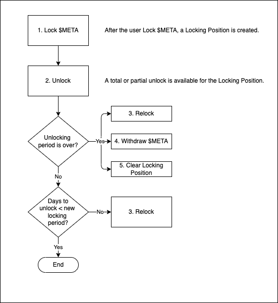

# Meta Vote Contract


Implementation of a general voting system using the $META token.

## Versions

The last version of the deployed contract, in Near `mainnet`, is in the `stable` branch.

Current stable version: [**v0.1.0**](https://github.com/Narwallets/meta-vote/releases/tag/v0.1.0)
Check all releases in [Meta Vote Releases](https://github.com/Narwallets/meta-vote/releases).

To get the stable version, run the commands:

```sh
git clone https://github.com/Narwallets/meta-vote.git
cd meta-vote
git fetch origin --tags

git checkout tags/v0.1.0 -b stable
```

## Type Notation

```rs
// use near_sdk::json_types::U128;

pub type VoterId = near_sdk::AccountId;
pub type VotingPower = u128;
pub type Days = u16;
pub type Meta = near_sdk::Balance;
pub type ContractAddress = near_sdk::AccountId;
pub type VotableObjId = String;
pub type EpochMillis = u64;
pub type PositionIndex = u64;

pub struct LockingPositionJSON {
    pub index: Option<PositionIndex>,
    pub amount: U128,
    pub locking_period: Days,
    pub voting_power: U128,
    pub unlocking_started_at: Option<EpochMillis>,
    pub is_unlocked: bool,
    pub is_unlocking: bool,
    pub is_locked: bool,
}

pub struct VotableObjectJSON {
    pub votable_contract: String,
    pub id: VotableObjId,
    pub current_votes: U128
}
```

## Deploying a new instance of Meta Vote

```rs
pub fn new(
    owner_id: AccountId,
    min_locking_period: Days,
    max_locking_period: Days,
    min_deposit_amount: U128,
    max_locking_positions: u8,
    max_voting_positions: u8,
    meta_token_contract_address: ContractAddress,
) -> Self;
```

## Getting a list of paginated Voters

Getting all the voters with pagination using `testnet`:

```rs
NEAR_ENV=testnet near view metavote.testnet get_voters '{"from_index": 0, "limit": 100}'
```

## View Contract Functions

```rs
pub fn get_voters(&self, from_index: u32, limit: u32) -> Vec<VoterJSON>;

pub fn get_balance(&self, voter_id: VoterId) -> U128;

pub fn get_locked_balance(&self, voter_id: VoterId) -> U128;

pub fn get_unlocking_balance(&self, voter_id: VoterId) -> U128;

pub fn get_available_voting_power(&self, voter_id: VoterId) -> U128;

pub fn get_used_voting_power(&self, voter_id: VoterId) -> U128;

pub fn get_locking_period(&self) -> (Days, Days);

pub fn get_all_locking_positions(
    &self,
    voter_id: VoterId
) -> Vec<LockingPositionJSON>;

pub fn get_locking_position(
    &self,
    index: PositionIndex,
    voter_id: VoterId
) -> Option<LockingPositionJSON>;

pub fn get_total_votes(
    &self,
    contract_address: ContractAddress,
    votable_object_id: VotableObjId
) -> U128;

pub fn get_votes_by_contract(
    &self,
    contract_address: ContractAddress
) -> Vec<VotableObjectJSON>;

pub fn get_votes_by_voter(
    &self,
    voter_id: VoterId
) -> Vec<VotableObjectJSON>;

pub fn get_votes_for_object(
    &self,
    voter_id: VoterId,
    contract_address: ContractAddress,
    votable_object_id: VotableObjId
) -> U128;
```

## Mutating Contract state

```rs
// *************
// * Unlocking *
// *************

pub fn unlock_position(&mut self, index: PositionIndex);

pub fn unlock_partial_position(&mut self, index: PositionIndex, amount: U128);

// ***********
// * Re-Lock *
// ***********

pub fn relock_position(
    &mut self,
    index: PositionIndex,
    locking_period: Days,
    amount_from_balance: U128
);

pub fn relock_partial_position(
    &mut self,
    index: PositionIndex,
    amount_from_position: U128,
    locking_period: Days,
    amount_from_balance: U128
);

pub fn relock_from_balance(
    &mut self,
    locking_period: Days,
    amount_from_balance: U128
);

// ******************
// * Clear Position *
// ******************

pub fn clear_locking_position(&mut self, position_index_list: Vec<PositionIndex>);

// ************
// * Withdraw *
// ************

pub fn withdraw(
    &mut self,
    position_index_list: Vec<PositionIndex>,
    amount_from_balance: U128
);

pub fn withdraw_all(&mut self);

// **********
// * Voting *
// **********

pub fn vote(
    &mut self,
    voting_power: U128,
    contract_address: ContractAddress,
    votable_object_id: VotableObjId
);

pub fn rebalance(
    &mut self,
    voting_power: U128,
    contract_address: ContractAddress,
    votable_object_id: VotableObjId
);

pub fn unvote(
    &mut self,
    contract_address: ContractAddress,
    votable_object_id: VotableObjId
);
```

## Locking and Unlocking process

To Lock funds into the Meta Vote contract, the user must define an amount in the $META token and a number of days (between 30 and 300 days) to lock the funds.



## Consider:

- To reclaim the META tokens, you will have to wait the period selected in the locking period.
- Implement **NEP264** for cross-contract calls: https://github.com/near/near-sdk-rs/issues/740
- Release notes for `near-sdk = "4.0.0"`: https://github.com/near/near-sdk-rs/discussions/797
