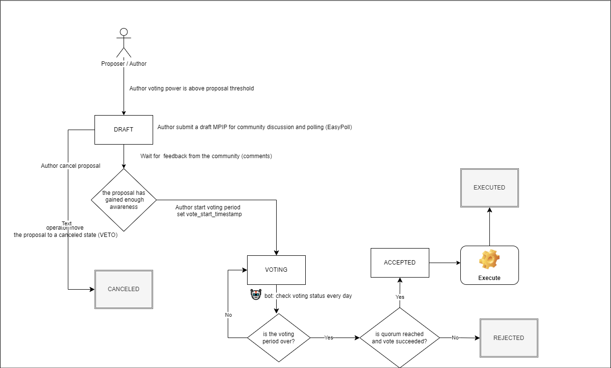

# Meta Pool Improvement Proposals (MPIPs)

## Overview

Meta Pool aims for MPIPs is to serve as the primary mechanism for proposing new features, new protocol parameters changes. The goal is to establish a highly participatory and transparent process for complex decision making or changes to the Meta Pool Protocol. The vision for Meta Pool is for more decentralized decision-making.

## What is a MPIP?

A MPIP is a document that consist of

- a title
- a one-line human readable description
- a body description containing technical specification of the feature or protocol parameters changes
- a creator (or proposer or author) account
- could contains feedback from the Meta Pool community via comments and/or via polling (eg EasyPoll).
- could contains calldata encoding a function call that the contract will perform if the proposal passes

## Roles

- **admin** is the top-level owner of the governance contract. The admin address has the following superpowers:

  - set open for new MPIPs
  - update operator address role
  - update admin address role

- **operator** address used in day-to-day operations of the governance system. The operator address has the following superpowers:

  - Update voting period (number of days a proposal can be voted on)
  - Update voting delay (delay in millisecond a proposal can transitioned to be voted on)
  - Update proposal threshold (min voting power amount to submit a vote)
  - Update MPIP storage cost per kilobyte
  - Update quorum floor (percentage of total voting power required to pass a proposal)
  - Cancel a proposal (only for active proposal)
  - Mark proposals from the community to start voting period ( proposals from Draft to Voting )

- **creator/proposer/author** is any address that has reach the proposal threshold. The creators can perform the following actions:
  
  - Create proposal (should reach proposal threshold)
  - Cancel proposal (only for active proposals)
  - Get all proposal created by the author
  
- **voter** is any address that has Voting Power

  - Vote on proposals
  - Delegate votes to another address (not implemented)
  - Get all votes (proposals votes which the author has voted)
  - Get vote on proposal

## MPIP Process

The Proposal life cycle:

**Draft** -
    Creation Criteria : Author voting power is above proposal threshold : voting power above minimum requested.
    Author submit a draft MPIP for community discussion and polling (eg EasyPoll). Community, dev team provide feedback on the MPIP.

**Active** - The draft proposal has gained sufficient traction during the review window for an MPIP and has been accepted to proceed to the voting period or canceled if not.

**Voting** - The proposal is opened for voting.
~~Note: All feedback in the form of comments and polls is dumped on-chain into the proposal before the proposal vote begins.~~

**Accepted** - The proposal has reach the quorum floor and the amount of "For" votes is greater than "Against" vote.
**Rejected** - The proposal has reach the quorum floor and the amount of "For" votes is lower than "Against" vote.
**Executed** - The proposal has been accepted and the underlying function call (if exist) has been executed.

## MPIP Workflow

### Create a MPIP
